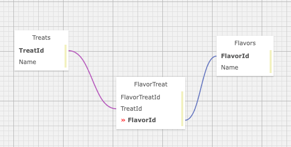

# _Pierre's Treats and Flavors_

#### By: _**Albert Lee**_

#### _This MVC application uses Identity to create Authentication for  a webpage that tracks a Many-to-Many Relationship between Treats and Flavors._

## Technologies 
* C#
* ASP.NET Core MVC EF
* MySQL, MySQL Workbench
* Entity
* Identity
* dotnet script, REPL
* Razor View Engine
* NuGet
* LINQ
* Bootstrap CSS

## Description

This project is part of the Epicodus School, focusing on MVC framework and SQL databases. The user will be able to register an account, and use that account to Log In and Log Out. Registered users will be able to use Full CRUD functionality. Unauthorized users will only be able to the the Index and Details pages The data is displayed with Razor and HTML helpers.



## Setup/Installation Requirements

### Application Setup
* _Install [.NET 5.0](https://dotnet.microsoft.com/download/dotnet/5.0)_
* _Clone repository to desired location_
  > https://github.com/leesga8/Treats.Solution
* _Open the terminal on your desktop and navigate to_
  >Treats.Solution/Treats
* _Create a file called `appsettings.json`_
* _Write following code with your password replacing `YOUR_DATABASE` and `YOURPASSWORDHERE`_
```{
    "ConnectionStrings": {
    "DefaultConnection": "Server=localhost;Port=3306;database=YOUR_DATABASE;uid=root;pwd=YOURPASSWORDHERE;"
      }
    }
```

### Database Setup/Installation 
* _Download and open MqSql Workbench and connect to localhost:3306_
* _In the Navigator > Administration window, select Data Import/Restore_
* _In Import Options select Import from Self-Contained File_
* _Select albert_lee.sql_
* _In 'Import Progress' click `Start Import`_
* _Run `dotnet restore` to install packages_
* _Run `dotnet ef database update` to build database_
* _Run `dotnet run` in terminal to open project_

## Known Bugs

* _No known bugs_

## License

[MIT](https://opensource.org/licenses/MIT)

Copyright (c) 2021 Albert Lee

## Contact Information

Albert Lee: <leesga8@gmail.com>